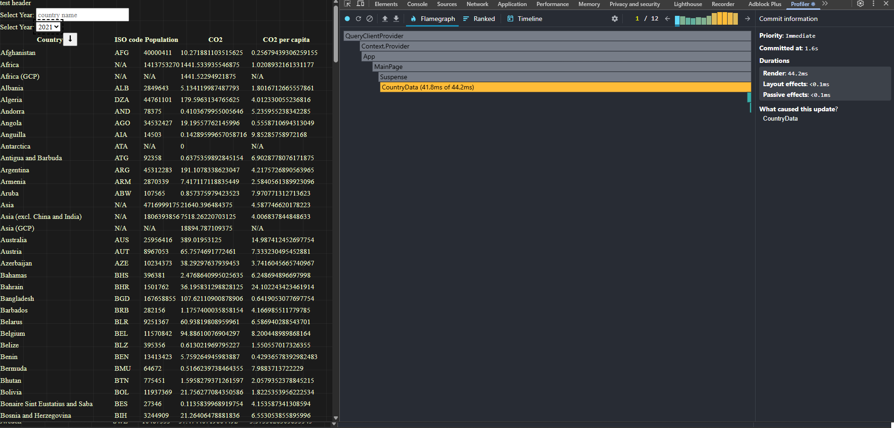
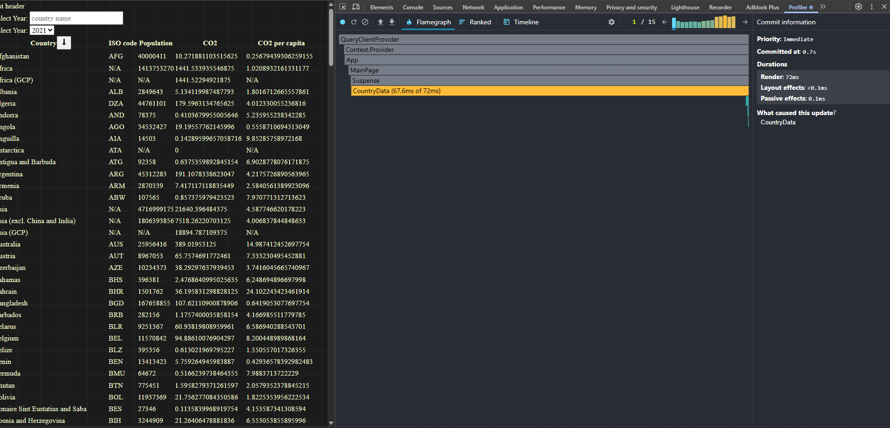

### 📊 CountryData Profiling Results before optimization

| Action                 | Commit Duration (ms) | Render Duration (ms) | Interactions (what triggered)        | Flame Graph (what re-rendered)  | Ranked Chart (slowest components)   |
|------------------------|----------------------|----------------------|--------------------------------------|---------------------------------|-------------------------------------|
| 🔍 Searching a country | 2.2 s                | 44.1 ms              | Typing in `search-input`             | All table rows re-rendered      | `CountryData → TableRow`            |
| 📅 Changing the year   | 2.4 s                | 96.7 ms              | Selecting a year in `year-select`    | Only cell values re-rendered    | `CountryData → TableRow`            |
| ↕️ Sorting countries   | 1.4 s                | 1.2 s                | Clicking sort button                 | Entire country list re-rendered | `CountryData → TableRow`            |
| ⏳ Select columns       | 1.7 s                | 88 ms                | Clicking the "Select Columns" button | Modal, then the entire table    | `CountryData → ColumnSelectorModal` |

### 📊 CountryData Profiling Results after optimization

| Action                 | Commit Duration (ms) | Render Duration (ms) | Interactions (what triggered)        | Flame Graph (what re-rendered)  | Ranked Chart (slowest components)   |
|------------------------|----------------------|----------------------|--------------------------------------|---------------------------------|-------------------------------------|
| 🔍 Searching a country | 4.5 ms               | 28.1 ms              | Typing in `search-input`             | All table rows re-rendered      | `CountryData → TableRow`            |
| 📅 Changing the year   | 98 ms                | 25.6 ms              | Selecting a year in `year-select`    | Only cell values re-rendered    | `CountryData → TableRow`            |
| ↕️ Sorting countries   | 107.7 ms             | 101 ms               | Clicking sort button                 | Entire country list re-rendered | `CountryData → TableRow`            |
| ⏳ Select columns       | 1.1 s                | 60 ms                | Clicking the "Select Columns" button | Modal, then the entire table    | `CountryData → ColumnSelectorModal` |
